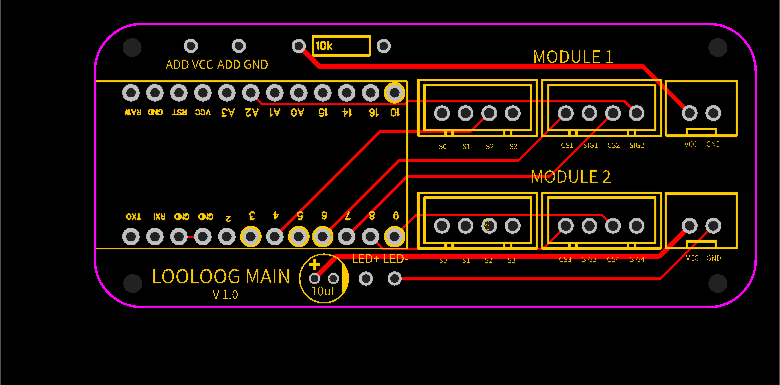
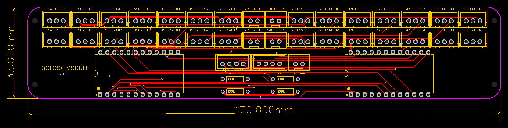

# looloog

The looloog is a custom-made midi instrument intended to make inputs for [vcvrack](https://vcvrack.com/)

The case is made out of wood, the electronics is based on arduino, and custom pcb allows for 56 pots and 8 buttons wired simultaneously, all encoded in midi and transmitted through USB. Of course it's a USB type B, it's a controller :)

## Hardware
The hardware is made out of :
- an arduino "pro micro" board; this board is an equivalent of the arduino leonardo board which allows for HID devices and classic arduino programming on the same USB port, all in a condensed package. The version is the 5v/16Mhz version.
- four CD74HC4067 multiplexers; these are 16 inputs multiplexers that allows to connect analog or digital inputs and route them to a single input on the arduino board. The revision used is the E version which was more available than the standard version and has a larger footprint
- Custom PCBs, one for the main board of the arduino, two for the controls on each panel
- 56x 100k variable potentiometers
- 8 push buttons

## Prototype

Original prototype was made on a breadboard to validate the minimum hardware and that digital and analog input could be used on the same multiplexer.

## PCBs

All PCB designs made with EasyEDA; the choice has been made to handle all the wiring with JST-XH connectors, which looked like a good compromise between connectivity and space used on the PCB.

### Main PCB

The main PCB holds the arduino board and connects to the two module boards. A small capacitor has been added to the board to handle possible power issues. While designing the PCB, external wires were planned in case the arduino does not provide enough current for the circuit, but this turned out to not be a problem when the full assembly was finished.

Gerber file available here : [Main PCB gerber](schematics/pcb/pcb-looloog-main.zip)

### Module PCB

A module PCB holds two multiplexers to handle 28 potentiometers and 4 push buttons. The connectors layout has been lined up so that the inputs can be wired along all the length of the controller. Planning the push buttons in the middle turned out to be a bit short on one of the layouts, this could be improved on other revisions of the PCB design.

Gerber file available here : [Module PCB gerber](schematics/pcb/pcb-looloog-module.zip)

## Code
