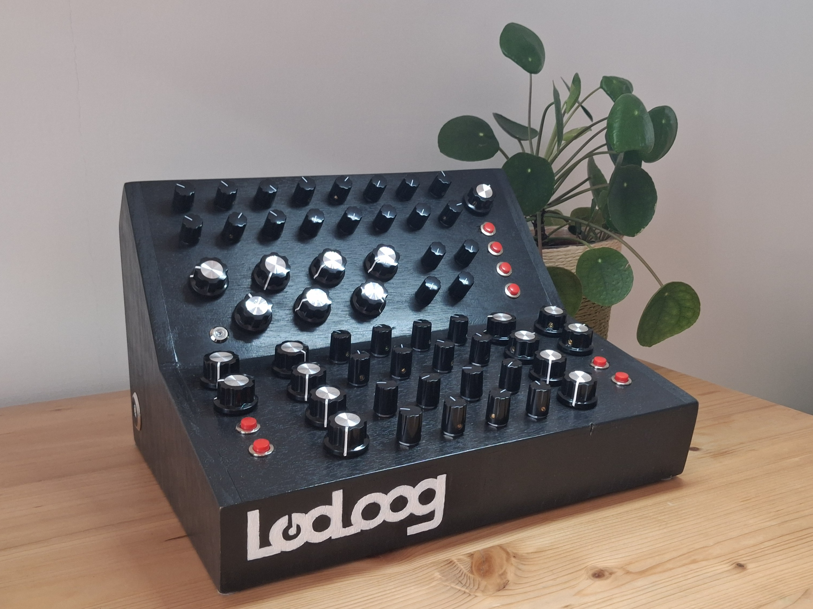
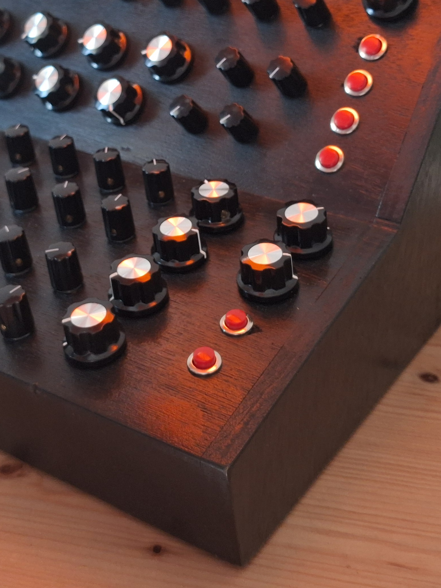
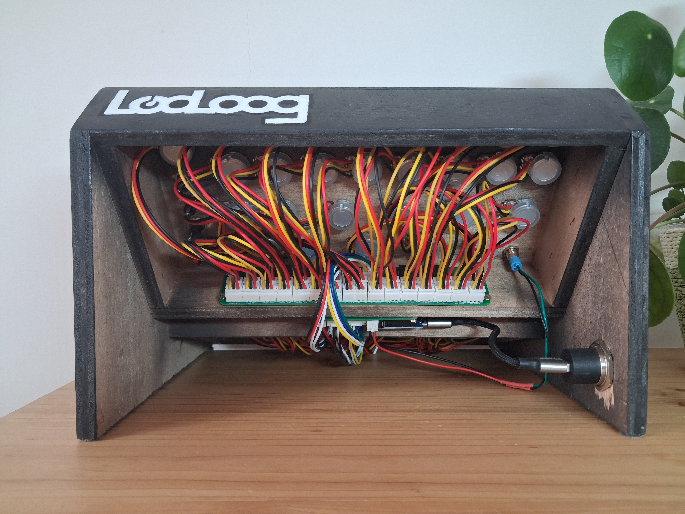
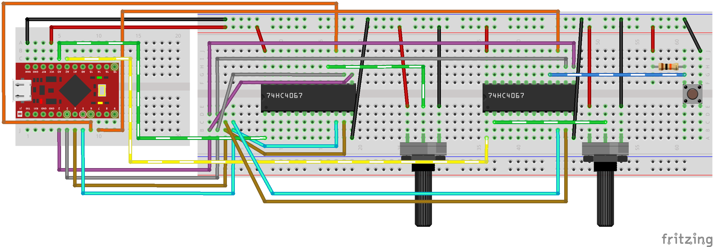

# looloog

The looloog is a custom-made midi instrument intended to make inputs for [vcvrack](https://vcvrack.com/)

The case is made out of wood, the electronics is based on arduino, and custom pcb allows for 56 pots and 8 buttons wired simultaneously, all encoded in midi and transmitted through USB. Of course it's a USB type B, it's a controller :)

## Code

## Hardware

## Prototype

Original prototype was made on a breadboard to validate the minimum hardware and that digital and analog input could be used on the same multiplexer.

